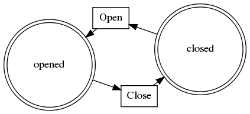

# Example Designs

Each of the designs shown here demonstrates particular features of FireEngine.

## Example: Simple Design ##

The 'Hello World' of Activities  
See `config.example/designs/simple_v1.js`

    module.exports = {
        id: 'simple_v1',
	    name: 'Simple Design',
        version: 1,
        states: ['opened', 'closed'],
        create: {
            to: ['opened']
        },
        actions: [
            { 
                id: 'close',
                from: ['opened'], 
                to: ['closed'] 
            },
            { 
                id: 'open',
                from: ['closed'], 
                to: ['opened'] 
            }
        ]
    }

* It has two states, `opened` and `closed`.
* It has two actions, `open` and `close`.

There are no restrictions on who may view or fire Actions, and no special behaviours defined.

## Example: Allowed Activity ##

Setting of Activity-wide restrictions on the Activity.
See `config.example/designs/allowed_activity_v1.js`

	module.exports = {
		...
		//Activity-wide restrictions
		allowed: {
			//Only admin or manager can read the activity (adummy & bdummy can read, cdummy cannot)
			read: ['manager', 'admin'], 
			//Only the admin or creator can fire actions *unless* in the 'unlocked' state
			fire: function() { 
				return _.contains(activity.get('state'), 'unlocked') 
                    || _.intersection(user.get('roles'), ['admin', 'creator']).length; 
			}
		},
		...
	};

* A Design may set the `allowed` property to restrict access Activity-wide.
* The `allowed` property must be an object, mapping operation to rule.
 * Keys are types of operation, eg `read`, or `fire`.
 * Values are Rules.

### Operations ###
The supported operations are:

 * **read** : Read requests check the `read` rule before returning the Activity. If an Activity in a view cannot be read, it will be omitted from the results. If a fetched Activity cannot be read, a *Forbidden* response will be sent.
 * **fire** : Actions check the Activity `fire` rule before firing. If an Action defines its own `allowed` rule, both must allow the firing.

### Rules ###
Rules can be defined as any of the following:

 * Role name, or array of role names. Allows if the user has any of the listed roles.  
   eg: `["foo", "bar"]`
 * Object with `any` and/or `all` properties. Allows if the user has any `any` role, and all `all` roles.  
   eg: `{ any: ['foo', 'bar', 'baz'], all: ['admin', 'staff'] }`
 * Function or function string. Allows if returns a truthy value when called.  
   eg: `function() { return user.id == 'freddy'; }`

